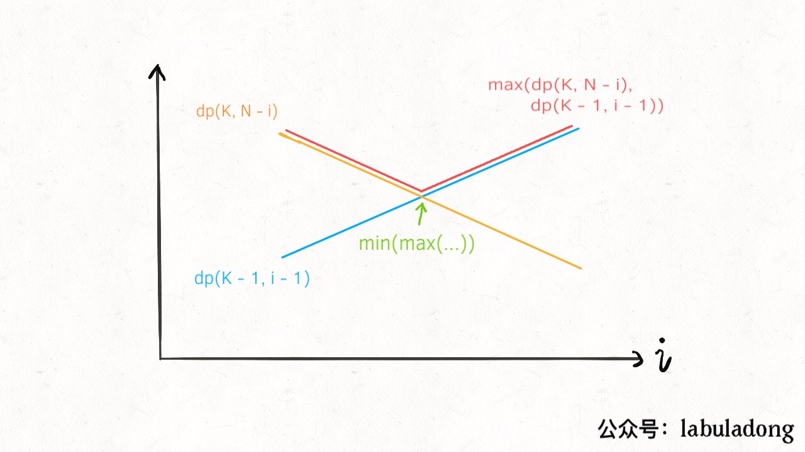

# 题目描述:  鸡蛋掉落

你将获得 K 个鸡蛋，并可以使用一栋从 1 到 N  共有 N 层楼的建筑。

每个蛋的功能都是一样的，如果一个蛋碎了，你就不能再把它掉下去。

你知道存在楼层 F ，满足 0 <= F <= N 任何从高于 F 的楼层落下的鸡蛋都会碎，从 F 楼层或比它低的楼层落下的鸡蛋都不会破。

每次移动，你可以取一个鸡蛋（如果你有完整的鸡蛋）并把它从任一楼层 X 扔下（满足 1 <= X <= N）。

你的目标是确切地知道 F 的值是多少。

无论 F 的初始值如何，你确定 F 的值的最小移动次数是多少？

**示例 :**
```
输入：K = 1, N = 2
输出：2
解释：
鸡蛋从 1 楼掉落。如果它碎了，我们肯定知道 F = 0 。
否则，鸡蛋从 2 楼掉落。如果它碎了，我们肯定知道 F = 1 。
如果它没碎，那么我们肯定知道 F = 2 。
因此，在最坏的情况下我们需要移动 2 次以确定 F 是多少。
```

# 解题思路:
  动态规划：
  
  1. 定义状态：dp[i][k]，表示一共有 i 层楼的情况下，使用 k 个鸡蛋的最少实验的次数
  
  2. 状态转移方程：
  $$
   dp[i][k]=\min _{1 \leq j \leq i}(\max (d p[j-1][k-1], dp[i-j][k])+1)
  $$
  
  3. 初始状态：
  ```
  dp[i][1] = i; // 只有一个鸡蛋的时候，只能一层一层的扔
  ```
  4. 返回结果：
   ```
   dp[N][K];
   ```
  
  5. 考虑优化
  
  观察状态方程：
  
  $$
   dp[i][k]=\min _{1 \leq j \leq i}(\max (d p[j-1][k-1], dp[i-j][k])+1)
  $$
  
「状态转移方程」里最外层的变量是j，它枚举了扔下鸡蛋的楼层的高度，这里它是自变量，将其余的 i 和 k 视为常数：

 - dp[j - 1][k - 1]：根据语义，j 增大的时候，楼层越高，它的值就越大；
 - dp[i - j][k]：根据语义，j 增大的时候，楼层越低，它的值就越小。
 
把这两个函数看做关于 j 的函数,可以得出dp[j - 1][k - 1]是单调增的，dp[i - j][k]是单调减的。



这时候求二者的较大值，再求这些最大值之中的最小值，其实就是求这两条直线交点，也就是红色折线的最低点
  
# 时间复杂度：
  1. $O(N^2K)$
  
  2. $O(NlogNK)$
# 空间复杂度
  1. $O(NK)$
  
  2: $O(NK)$
  
# 代码
### dp（超时）
```c++
class Solution {
public:
    int superEggDrop(int K, int N) {
        // 定义状态：dp[i][k]表示一共有 i 层楼的情况下，使用 k 个鸡蛋的最少实验的次数
        vector<vector<int>> dp(N + 1, vector<int>(K + 1, 0));
        // 初始化dp数组
        for (int i = 0; i <= N; i++) dp[i][1] = i; // 只有一个鸡蛋的时候，只能一层一层的扔

        for (int i = 1; i <= N; i++) 
        {
            for (int k = 2; k <= K; k++) 
            {
                // 状态转移方程
                int res = i; 
                for (int j = 1; j <= i; j++) 
                {
                    // 碎了，就需要往低层继续扔：层数少 1 ，鸡蛋也少 1
                    // 不碎，就需要往高层继续扔：层数是当前层到最高层的距离差，鸡蛋数量不少
                    // 两种情况都做了一次尝试，所以加 1
                    res = min(res , max(dp[j-1][k-1], dp[i-j][k]) + 1);
                }
                dp[i][k] = res;
            }
        }
        return dp[N][K];
    }
};
```
###  dp二分优化
```c++
class Solution {
public:
    int superEggDrop(int K, int N) {
        vector<vector<int>> dp(N+1, vector<int>(K+1,0));
        for (int i=0;i<=N;i++) dp[i][1]=i;
        
        for (int i=1;i<=N;i++)
        {
            for (int k=2;k<=K;k++)
            {
                int res = i;
                int start=1, end = i;
                // 二分法优化
                while(start<=end)
                {
                    int mid = start + (end-start)/2;
                    // 取两者的最大值，然后再取最大值中的最小值，就是求山谷的问题
                    if (dp[mid-1][k-1]==dp[i-mid][k])
                    {
                        res = min(res,dp[mid-1][k-1]+1);
                        break;
                    }
                    else if (dp[mid-1][k-1]>dp[i-mid][k])
                    {
                        end = mid-1;
                        res = min(res, dp[mid-1][k-1]+1);
                    }
                    else if (dp[mid-1][k-1]<dp[i-mid][k])
                    {
                        start = mid+1;
                        res = min(res,dp[i-mid][k]+1);
                    }
                }
                // for (int j=1;j<=i;j++)
                // {
                //     res = min(res, max(dp[j-1][k-1],dp[i-j][k])+1);
                // }
                dp[i][k] = res;
            }
        }
        return dp[N][K];
    }
};
```
### dp（最优解法）
```c++
// 动态规划的dp定义和子问题定义确定了dp递推公式，不同的角度可能有不同的dp解法
// 并且存在时间复杂度、空间复杂度上的差异
// 这种dp反正我是想不到的，题解中的大佬牛逼
// 这里给出这种的dp角度的问题求解
//
// 1、无论你在哪层楼扔鸡蛋，鸡蛋只可能摔碎或者没摔碎，碎了的话就测楼下，没碎的话就测楼上。
// 2、无论你上楼还是下楼，总的楼层数 = 楼上的楼层数 + 楼下的楼层数 + 1（当前这层楼）。
// 根据这个特点，可以写出下面的状态转移方程：
// dp[k][m] = dp[k][m - 1] + dp[k - 1][m - 1] + 1
// dp[k][m - 1] 就是楼上的楼层数，因为鸡蛋个数 k 不变，也就是鸡蛋没碎，扔鸡蛋次数 m 减一；
// dp[k - 1][m - 1] 就是楼下的楼层数，因为鸡蛋个数 k 减一，也就是鸡蛋碎了，同时扔鸡蛋次数 m 减一。
// 上述递推公式可以这样理解，一次扔鸡蛋至少能推测1层楼，剩余m-1次扔鸡蛋则分别可以推测dp[k-1][m-1]和dp[k][m-1]层楼
// dp[k-1][m-1]表示如果这次扔鸡蛋破了，那么只剩下k-1个鸡蛋和m-1次扔鸡蛋的机会可以探测到的最高楼层数
// dp[k][m-1]表示这次扔鸡蛋没有碎，还剩下k个鸡蛋和m-1次扔鸡蛋机会可以探测到的最高楼层数
// 同时还有本身扔鸡蛋的这一层楼
// 一共能够推测的楼层就是上述三者之和

// 时间复杂度O(K*N) 事实上，更准确的时间复杂度应当为 O(K∗T)，我们不加证明地给出 N=O(T^K)，因此有O(K*T) = O(K*\sqrt[K]{N})
// 空间复杂度O(K*N)

int superEggDrop(int K, int N) {
    vector<vector<int>> dp(K+1, vector<int>(N+1, 0));
    int m = 0;
    while (dp[K][m] < N) 
    {
        m++;
        for (int k = 1; k <= K; k++)
            dp[k][m] = 1 + dp[k-1][m-1] + dp[k][m-1];
    }
    return m;
}
```
